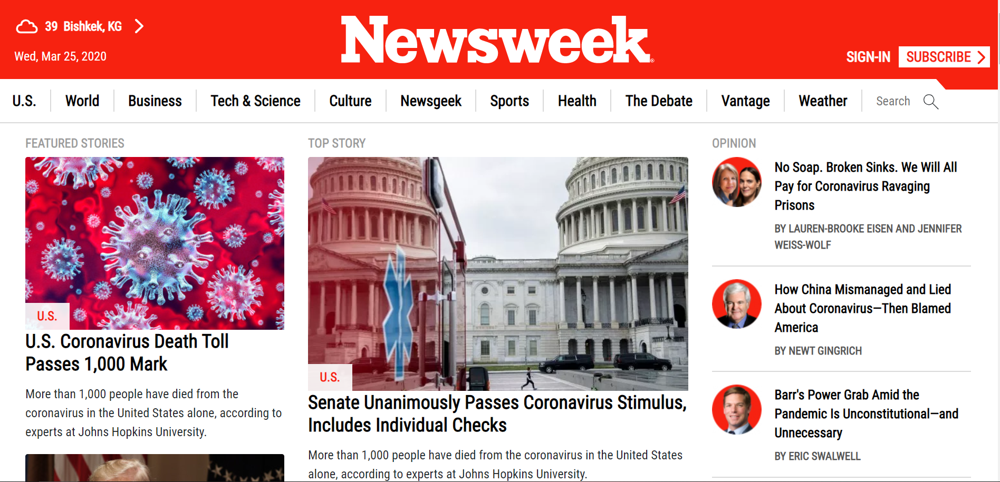

# Newsweek clone
Clone of Newsweek.com web page for study purpose

[Original site](https://www.newsweek.com/)

> This is an assigment for Microverse HTML and CSS course. The goal is to clone the Newsweek.com page with static functionability.

Additional description about the project and its features.

## Built With

- HTML,
- CSS,
- Bootstrap

## Live Demo

[Live Demo](https://rawcdn.githack.com/NiiazalyDzhumaliev/newsweek-bootstrap/f053b73ae738120c6a6ecf968a6554a14f4c83b9/index.html)

## Getting Started

To get a local copy up and running follow these simple example steps.

### Prerequisites

- A compatible browser with HTML and CSS. 

### Install

- Just clone the project

### Usage

- Open the index.html file in any browser or edit using Visual Code or the preference IDE for web development

## Author

👤 **Niiazaly Dzhumaliev**

- Github: [@NiiazalyDzhumaliev](https://github.com/NiiazalyDzhumaliev)
- Twitter: [@Niiazaly1](https://twitter.com/Niiazaly1)
- Linkedin: [@niiazaly-dzhumaliev](https://www.linkedin.com/in/niiazaly-dzhumaliev-117707132/)

## 🤝 Contributing

Contributions, issues and feature requests are welcome!

Feel free to check the [issues page](https://github.com/NiiazalyDzhumaliev/newsweek-bootstrap/tree/features).

## Show your support

Give a ⭐️ if you like this project!

## Acknowledgments

- The Odin Project
- Newsweek.com

## 📝 License

This project is free to use as learning purposes. For any external content (e.g. logo, images, ...), please contact the proper author and check their license of use.
